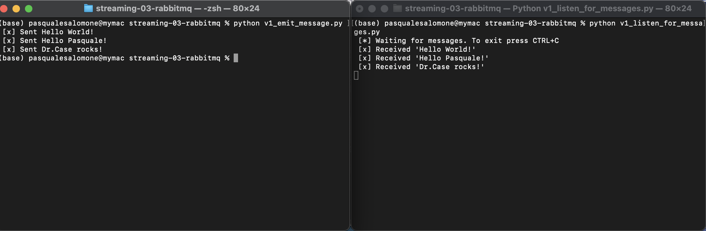

# Project Title: streaming-03-rabbitmq
## Introduction
This project demonstrates how to get started with RabbitMQ, a message broker, that enables multiple processes to communicate reliably through an intermediary

#### Author: Pasquale Salomone, 28 August 2023

## Prerequisites

1. Git
1. Python 3.7+ (3.11+ preferred)
1. VS Code Editor
1. VS Code Extension: Python (by Microsoft)

The following modules are required: 

| Module          | Version  |
|-----------------|----------|
| csv             | 1.0      |
| random          | 3.11.4   |
| sys             | 3.11.4   |
| time            | 3.11.4   |
| pika            | 1.3.2    |

## Notes
- Each of the files version  programs include an error (the locahost was spelled incorrectly) 
- In the updated version, a variable `{message}` holds the message. 
- To send a new message, you'll only make one change.
Updating and improving code is called 'refactoring'. 
- Should Imports be one per line - why? <i> In my opinion, using separate lines is not necessarily better or worse than importing them on a single line; it's more a matter of coding style and readability.</i>
- Functions are reuable logic blocks.
- Everything the function needs comes in through the arguments; however, there are cases where functions might also rely on external factors such as global variables, environment variables, or other resources. These external factors are not strictly provided through function arguments, but they can still influence the behavior of the function.
- A function may - or may not - return a value.
- Friendly reminder, when we open a connection, we should close the connection. 
- Of the 4 files, the emit message files will always have to close a connection.</i>
- This python idiom `if __name__ == "__main__":` is very common; a google search returned about 528,000 results (0.48 seconds)</i>

## Reference

- [RabbitMQ Tutorial - Hello, World!](https://www.rabbitmq.com/tutorials/tutorial-one-python.html)
- [Using Python environments in VS Code](https://code.visualstudio.com/docs/python/environments)

## Multiple Terminals

## Additional Resources

1. For more information about Git in VS Code, see [Using Git source control in VS Code](https://code.visualstudio.com/docs/sourcecontrol/overview).
1. For more information about editing Markdown in VS Code, see [Markdown and Visual Studio Code](https://code.visualstudio.com/docs/languages/markdown).

## Acknowledgments

I would like to acknoledge both Stackoverflow and ChatGPT as an instrumental aid in the development of this project.
